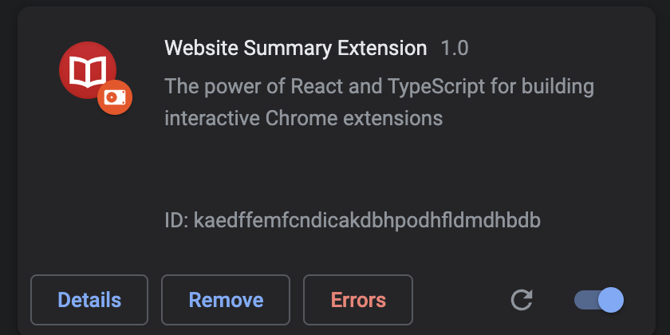
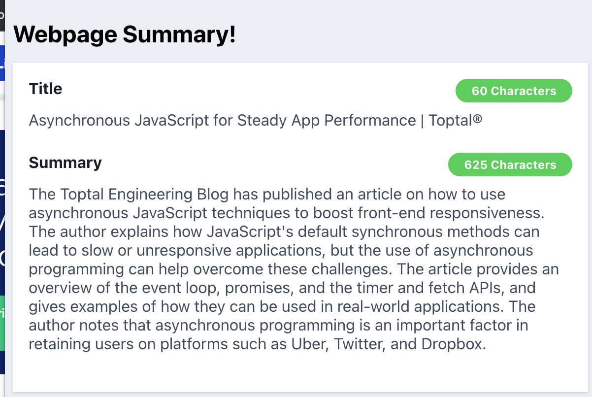

# Website Summary Extension

Chrome extension

# Set up

- Create a `.env` file then Add you own chatgpt API key as:

```
REACT_APP_KEY=your_api_key
```

- On terminal:

```bash
npm i
```

```bash
npm run build
```

- Go to `chrome://extensions/` then click `Load Unpacked` on top left corner

# Showcase






https://user-images.githubusercontent.com/25517478/224609885-0d785a83-b7eb-49c7-abcd-cef2806c4209.mov


# Create React App

```bash
npx create-react-app file-name --template typescript
```
